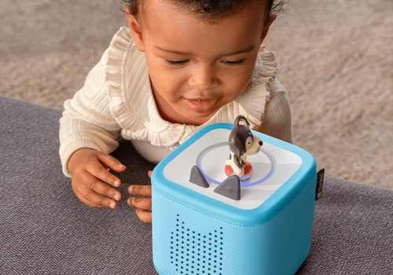

<p align="center">
  
</p>

# Tonies for Homey

**Start night mode from a Flow. Pause a story from your phone. Let your home react when listening begins.**

[](https://github.com/kamilio/tonies-homey/actions/workflows/test.yml)


An unofficial, cloud-connected Homey app built around **Toniebox 2 only**—not original Tonieboxes, Toniebox Lite, or individual figurines as devices.

**[Changelog](CHANGELOG.md) · [Start here](#start-here) · [Flow recipes](#flow-recipes) · [Action cards](#then--action-cards) · [Trigger cards](#when--trigger-cards) · [Conditions](#and--condition-cards) · [Limits](#what-to-expect)**

> **Early-access source install.** Not published in the Homey App Store. Installation and startup are verified on a physical Homey Pro. Core controls have been tested against a real Toniebox 2; the event bridge has been exercised with real telemetry and a simulated Homey host, while end-to-end paired-device Flows on the hub still need verification.

## Start here

### What you need

- A **Toniebox 2**, already set up in your Tonies account and connected to Wi-Fi.
- A **Homey Pro** on Homey **12.9.0 or later**; the app targets Homey's local platform, not cloud-only Homey.
- Your Tonies account email and password for pairing.
- Internet access. This is not a local-network Toniebox protocol.

### Install from GitHub

With **Git and Node.js 22+** on your computer:

```sh
git clone https://github.com/kamilio/tonies-homey.git
cd tonies-homey
npm ci
npm run build
npx homey login
npx homey select
npx homey app install
```

Homey's CLI prompts you to sign in and select your hub. The app's SDK dependency comes directly from a **public, commit-pinned [GitHub repository](https://github.com/kamilio/tonies-sdk)**; no SDK registry release, private package, GitHub token, or manual archive download is needed. npm still downloads ordinary third-party dependencies from the npm registry.

### Pair your box

1. In Homey, choose **Devices → Add device → Tonies → Toniebox 2**.
2. Sign in with your **Tonies** account—not your Homey account.
3. Select the Toniebox 2 devices you want to add.
4. Wake a box by squeezing an ear, then try its **Night mode** toggle.

Only rotating account tokens are retained in app settings, not your password. Boxes on the same account share a session. If sign-in stops working later, use the device's repair flow to sign in again.

**You do not need to sign in again when an access token expires.** The app renews it automatically using the refresh token, persists rotated tokens, and updates the credentials used for MQTT reconnects—even while idle. A rejected API access token is refreshed and the request retried once. If Tonies expires or revokes the refresh token itself, use **Repair** to reconnect your Tonies account; the app deliberately does not retain your password to log in again silently.

## Night mode, first

The **Night mode** tile starts the box's native **sleep timer with light**. Its default duration is **30 minutes**, configurable in device settings; Flow actions accept **1–720 minutes**.

| You want to… | Use |
| --- | --- |
| Start bedtime now | Turn on the **Night mode** tile. |
| Use a custom duration | **Start night mode for … minutes**. |
| Set a warm, dim bedtime light | **Set night light to … at …%**, e.g. `#ff8800` at `15%`. |
| Limit bedtime volume | **Set night volume limits to …% / …%**. |
| Cancel bedtime mode | **Stop night mode**, or turn off the tile. |
| Know how long is left | The device's **Night mode remaining** value. |

**The box must be awake and online.** Homey cannot remotely wake it. Starting night mode again restarts its duration; stopping it cancels this sleep-light timer, not scheduled sunrise alarms or every other bedtime feature. Bedtime volume limits are separate from current playback volume and may affect what you hear when night mode starts.

## Flow recipes

Create these with your Toniebox 2 device's cards; time, button, room-light, and notification cards come from Homey or the relevant device apps.

### A bedtime Tonie starts its own night timer

| When | And | Then |
| --- | --- | --- |
| **Playback started** | **Tonie … is on the box** + **Night mode is not active** | **Start night mode for 30 minutes** |

Find the Tonie ID in the device's **Tonie ID** value, or use the trigger's `tonie_id` tag. The night-mode condition matters: **Playback started** also fires on resume, so the guard avoids resetting the timer every time someone pauses the story.

### A bedtime button sets the mood

| When | And | Then, in order |
| --- | --- | --- |
| Your bedtime button is pressed | **Is online** | **Set night light to `#ff8800` at `15%`** → **Set night volume limits to `25%` / `25%`** → **Start night mode for 30 minutes** |

In Advanced Flow, connect the actions sequentially so the settings finish before the timer starts. Or set light and volume once, and keep the daily Flow to a single night-mode action.

### More useful one-minute automations

| Recipe | When | And | Then |
| --- | --- | --- | --- |
| Dim the bedroom for a story | **Playback started** | **Night mode is active** | Dim your room lights. |
| Pause when the doorbell rings | Your doorbell rings | **Playback is active** | **Pause playback**. |
| Resume with a bedside button | Your button is pressed | **Is online** | **Resume playback**. |
| Finish the bedtime scene | **The sleep timer completed** | — | Turn off the room lamp. |
| Remind me to charge | **Battery became low** | — | Send a notification using the `percent` tag. |
| Start a scheduled night timer | Homey's time trigger | **Is online** | **Start night mode for 20 minutes**. |

An online condition prevents trying to control a known sleeping box; it cannot guarantee the box stays connected until the action completes. Timer-completed automations require the app to receive the box's completion event.

## Then — action cards

Every action targets a paired Toniebox 2. IDs are included for an unambiguous reference, but you select the friendly card titles in Homey.

| Card | Values / behavior | ID |
| --- | --- | --- |
| **Start night mode for … minutes** | 1–720 minutes; starts/restarts the native sleep-light timer. | `night_mode_on` |
| **Stop night mode** | Cancels that timer, not scheduled alarms. | `night_mode_off` |
| **Set night light to … at …%** | Hex color, e.g. `#ff8800`; brightness 0–100%. | `night_light` |
| **Set night volume limits to …% / …%** | Speaker and headphone limits, each 1–100%. | `night_volume` |
| **Resume playback** | Resumes the current Tonie; does not wake the box. | `play` |
| **Pause playback** | Pauses the current story. | `pause` |
| **Next chapter** | Advances one chapter. | `next` |
| **Previous chapter** | Goes back one chapter. | `previous` |
| **Go to chapter …** | Chapter 1–999; **1 is the first chapter**. No seconds offset. | `seek` |
| **Set playback volume to …%** | 0–100%, mapped to 14 device levels. | `volume` |
| **Raise playback volume one step** | One device-volume step. | `volume_up` |
| **Lower playback volume one step** | One device-volume step. | `volume_down` |
| **Set speaker volume limit to …%** | 25%, 50%, 75%, or 100%; separate from live volume. | `volume_limit` |
| **Set light ring brightness to …%** | Normal light ring brightness, 0–100%. | `ring_brightness` |
| **Put to sleep** | Sleep now; **requires physical interaction to wake again**. | `sleep_now` |
| **Refresh settings** | Re-read cloud settings; not a content-download or wake action. | `refresh` |

Chapter range is the card's input range, not a promise that a particular Tonie has that many chapters. The device still determines which chapters exist.

## When — trigger cards

| Card | Tags | ID |
| --- | --- | --- |
| **Playback started** | `tonie_id`, `chapter`, `title` | `playback_started` |
| **Playback paused** | `tonie_id`, `chapter`, `title` | `playback_paused` |
| **Playback ended** | `tonie_id`, `chapter`, `title` | `playback_ended` |
| **The Tonie changed** | `tonie_id`, `chapter`, `title` | `tonie_changed` |
| **The chapter changed** | `tonie_id`, `chapter`, `title` | `chapter_changed` |
| **Night mode started** | — | `night_mode_started` |
| **Night mode stopped** | — | `night_mode_ended` |
| **The sleep timer completed** | — | `sleep_timer_completed` |
| **Came online** | — | `box_online` |
| **Went offline** | — | `box_offline` |
| **Headphone connection changed** | `connected` (boolean) | `headphones_changed` |
| **Battery became low** | `percent` (number) | `battery_low` |
| **Settings were applied** | — | `settings_applied` |

**How to use the tags:** `tonie_id` identifies the current figurine, `chapter` is 1-based (`0` when unknown), and `title` is the track title when available. A title may initially be empty while metadata loads; use Tonie ID rather than title for reliable filtering.

**What counts as an event:** playback-started includes resume; playback-ended requires an ended report, not merely silence or a disconnect. Battery-low fires when a known reading crosses from above 20% to 20% or below. A natural timer completion can produce both night-mode-stopped and timer-completed. Retained startup snapshots do not fire these transition cards, and duplicate playback packets do not repeatedly fire starts; this is not an event-history replay service.

## And — condition cards

| Card | Use it to check | ID |
| --- | --- | --- |
| **Playback is / is not active** | Whether a story is currently playing. | `is_playing` |
| **Is / is not online** | Whether the box reports connected. | `is_online` |
| **Night mode is / is not active** | Whether the native sleep-light timer is running. | `is_night_mode` |
| **Headphones are / are not connected** | Current headphone connection state. | `has_headphones` |
| **Tonie … is / is not on the box** | Match an exact Tonie ID. | `is_tonie` |

Use **online** as an additional guard for device controls; disconnected state is not a reliable statement about what somebody is doing locally with the box.

## On the device tile

| Controls | Readouts |
| --- | --- |
| Night mode toggle | Night-mode minutes remaining |
| Play / pause, next / previous | Track title, Tonie ID, chapter |
| Volume slider and volume steps | Battery percentage and low-battery alarm |
| Normal light-ring brightness | Online and headphone connection state |

Device settings also show the box ID and firmware, and let you change the default night-mode duration. Homey chapters start at **1**; the underlying [SDK/CLI](https://github.com/kamilio/tonies-sdk#command-cards) uses **0**.

## What to expect

| Capability | Status |
| --- | --- |
| Night mode on/off, pause/resume, live volume, next chapter | Verified against a real Toniebox 2 on **August 30, 2026**. |
| Playback-started/paused and night-mode-started/stopped handling | Verified with real device telemetry through the app's event bridge and a simulated Homey host. |
| Other cards | Implemented and covered by offline app tests; not all physical effects have been live-tested. |
| Installation and startup on a physical Homey Pro | Verified running on Homey 13.4.1 on **August 30, 2026**. |
| Paired-device controls and Flows on the physical Homey hub | Not yet end-to-end verified. |
| Precise time seeking | **Unavailable.** Tested firmware restarted the chapter instead; only chapter selection is exposed. |
| Remote wake | **Unavailable.** Squeeze an ear to wake the box. |
| Original Toniebox / Toniebox Lite | **Not paired** by this app. |
| Arbitrary remote Tonie selection / content upload | Not provided by this app; manage Creative-Tonie content with the [SDK](https://github.com/kamilio/tonies-sdk#recipes). |
| Local-only operation | Not supported; Tonies cloud access is required. |

### Fast troubleshooting

| Symptom | What to check |
| --- | --- |
| No boxes when pairing | Sign in to the right Tonies account; only Toniebox 2 devices are listed. |
| A control fails while the box is quiet | Wake it physically and check Wi-Fi; quiet and online are different states. |
| Night mode keeps extending | A playback-started Flow may run again after resume; add **Night mode is not active**. |
| Volume doesn't match the slider exactly | The hardware has 14 discrete levels; normal/nighttime caps can limit output. |
| A Flow fires without a track title | Metadata may arrive later; use `tonie_id` for matching. |
| An old action doesn't happen after reconnect | Intentional: expired/disconnected controls are not replayed later. |
| Account authentication stops working | Repair the Homey device and sign in again. |

The app uses pushed device state rather than polling playback. It shares account connections, coalesces repeated state updates, and bounds queues and metadata caches. Night controls have their own queue so they do not wait behind a burst of volume or chapter controls. A successful confirmed action requires matching device telemetry, not just cloud message acceptance; an already-satisfied control can return without sending another command.

## Privacy and support

Your Homey communicates with Tonies' cloud using your account tokens. The app does not make your box cloud-independent. Do not post tokens, passwords, account captures, or private device IDs in issues.

[Report an issue](https://github.com/kamilio/tonies-homey/issues) with your Homey version, app revision, Toniebox firmware, the card involved, and what you expected versus observed. For raw protocol and command-line usage, see **[Tonies SDK](https://github.com/kamilio/tonies-sdk)**. [Detailed behavior notes](USAGE.md) cover confirmations and connection handling.

## License

MIT. This is an independent project, not an official Tonies or Athom app; their names and trademarks belong to their respective owners.

The brand mark and product photographs are third-party Tonies assets, not MIT-licensed project artwork; see [artwork sources and rights](NOTICE.md). The distinct Toniebox 2 device icon is an original vector illustration.

<details>
<summary>MIT license text</summary>

Copyright (c) 2026 Kamil Jopek

Permission is hereby granted, free of charge, to any person obtaining a copy
of this software and associated documentation files (the "Software"), to deal
in the Software without restriction, including without limitation the rights
to use, copy, modify, merge, publish, distribute, sublicense, and/or sell
copies of the Software, and to permit persons to whom the Software is
furnished to do so, subject to the following conditions:

The above copyright notice and this permission notice shall be included in all
copies or substantial portions of the Software.

THE SOFTWARE IS PROVIDED "AS IS", WITHOUT WARRANTY OF ANY KIND, EXPRESS OR
IMPLIED, INCLUDING BUT NOT LIMITED TO THE WARRANTIES OF MERCHANTABILITY,
FITNESS FOR A PARTICULAR PURPOSE AND NONINFRINGEMENT. IN NO EVENT SHALL THE
AUTHORS OR COPYRIGHT HOLDERS BE LIABLE FOR ANY CLAIM, DAMAGES OR OTHER
LIABILITY, WHETHER IN AN ACTION OF CONTRACT, TORT OR OTHERWISE, ARISING FROM,
OUT OF OR IN CONNECTION WITH THE SOFTWARE OR THE USE OR OTHER DEALINGS IN THE
SOFTWARE.

</details>
